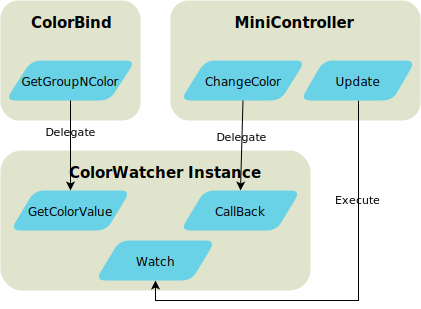

# ECS189L Programming Exercise 3: The Observer Pattern

## Description

The goals for this project are:
* To gain experience using the Watcher variant of the Observer design pattern.
* To implement and use the Publisher/Subscriber pattern.
* Implement functionality within the given project that adheres to the patterns presented in this assignment.

To learn more about the Observer design pattern, read the following:
* [Observer chapter](http://gameprogrammingpatterns.com/observer.html) from [Game Programming Patterns](http://gameprogrammingpatterns.com/) by Robert Nystrom
* [3. Observer Pattern](https://www.habrador.com/tutorials/programming-patterns/3-observer-pattern/) by Eric Nodreus

Here is a video from Microsoft's Visual Studio team about the pattern:  
* [Design Patterns: Observer and Publish-Subscribe](https://www.youtube.com/watch?v=72bdaDl4KLM)  

However, the watcher variant that will be implemented in this homework will be more inline with the polling version as discussed in the lecture.

This project will have a barebones implementation of a Real-Time Strategy (RTS) game that will resemble the Pikmin games that were developed Nintendo.

If you are unfamiliar with either RTS or Pikmin, here are some resources:

https://en.wikipedia.org/wiki/Real-time_strategy

https://en.wikipedia.org/wiki/Pikmin

This project uses various C# capabilities of handing first-class functions and functional programming. The constructs used are:
* [Delegates](https://docs.microsoft.com/en-us/dotnet/csharp/programming-guide/delegates/)
* [`Action<T>` Delegates](https://docs.microsoft.com/en-us/dotnet/api/system.action-1?view=netframework-4.8)
* [`Func<TResult>` Delegates](https://docs.microsoft.com/en-us/dotnet/api/system.func-1?view=netframework-4.8)

### Grading

The points distribution for the stages totals to 70 points and can be found in the table below. The remaining 30 points are for your peer-review of another student's submission.

| Stage | Points |
|:-----:|:------:|
|  1.1  |   10   |
|  1.2  |   10   |
|  2.1  |   15   |
|  2.2  |   10   |
|  2.3  |   10   |
|  3.0  |   15   |

### Due Date and Submission Information

This exercise is due Wednesday, October 30th at 11:59 pm on GitHub Classroom. The master branch as found on your individual exercise repository will be evaluated.

## Description of Provided Unity Project

### Scene and Game Objects in the Hierarchy

This project consists of a single scene call `PikminiPlayground` that is located in the Assets/Scenes directory. The following are descriptions of the game objects in the scene that you will be interacting with for this exercise:  

* **ScriptHome** is an empty `GameObject` container for select scripts.  
* **Canvas** holds the user interface elements used to select shapes, colors, and send commands to the Pikminis.  
* **Circle Destination, Cube Destination, and Cylinder Destination** are the locations that the Pikminis can be sent to.  
* **Spawn** serves as the initial spawn point for the Pikminis and is where the `GenerateMinis.cs` script resides.  

### Assets and Scripts

* **Prefabs/AniMini** is the prefab that will be used to instantiate Pikminis. There is an alternate meeple-themed prefab named * **Mini** that you can explore as well.  

The following are the scripts involved in this project:  
* **ButtonManager.cs** is a utility script that holds properties and methods that are used for responding to button pressed in the user interface. **This script initiates the messages for publishers to send to subscribers in Stage 2.**
* **ColorBind.cs** holds the unique colors for *Group1*, *Group2*, and *Group3* of Pikminis. It also contains methods to retrieve the color of a group (which is critical for the watchers in Stage 1!). 
* **ColorBindings** is not a script but an instantiation of an asset created via the [CreateAssetMenu](https://docs.unity3d.com/ScriptReference/CreateAssetMenuAttribute.html) attribute of `ColorBind`. You will not have to deal with the details of this attribute in the project. However, it is a handy trick to have in your bag.
* **ColorWatcher.cs** is a partial implementation of the Watcher variant of the Observer pattern that you will complete it in this exercise.
* **GenerateMinis.cs** is the script that generates randomly-parameterized Pikminis. In the stock exercise project, it is a component of the `Spawn` game object.
* **MiniController.cs** contains information about and controls individual Pikminis. Each generated Pikmini contains a `MiniController` component. You will be heavily modifying this file throughout the exercise.
* **PublisherManager.cs** contains an instance of the PubSub pattern for each of the three groups of Pikminis. You will be writing most of this script.
* **IPublisher.cs** is the interface declaration for publishers in this exercise and manages `Subscribe`, `Unsubscribe`, and `Notify` methods.
* **IWatcher.cs** is the interface declaration for watchers and mandates the `Watch` method.

## Stage 1: Watcher Pattern
In this stage, you will be creating a script that will watch the ColorBind script.
You will be using the polling watcher variant of the observer pattern to watch one of the three colors.
If one of the three colors in the ColorBind asset change (through manipulation within the editor), then the Game Object, one of the Minis, should change its own color. 

### 1.1: The Pikmini. Always watching, always changing.

This portion of the stage will require modification to the `ColorWatcher.cs` and `MiniController.cs` scripts.

In order to have the Pikmini change `Color`, the Pikmini must be watching the `ColorBinding` asset.

Here is a diagram that shows the relationship an instance of `ColorWatcher` has to the other scripts:

In order to do this, you must:

* Instantiate new `ColorWatcher` objects within the `Awake` function that passes in the correct delegates for the assigned `GroupID`. 
